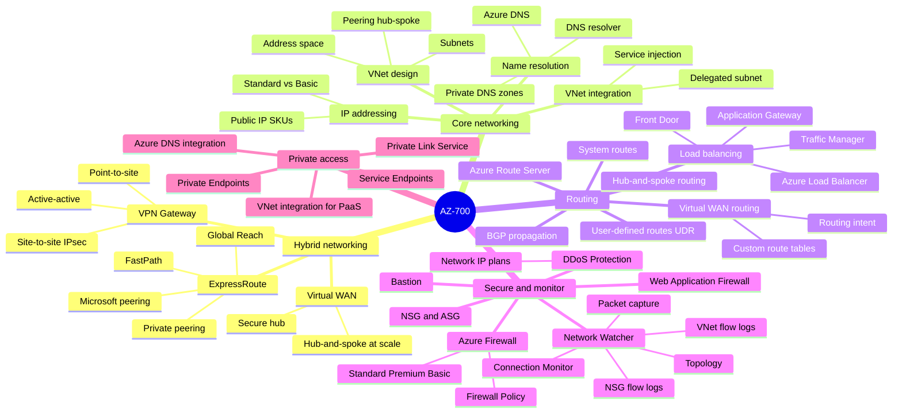
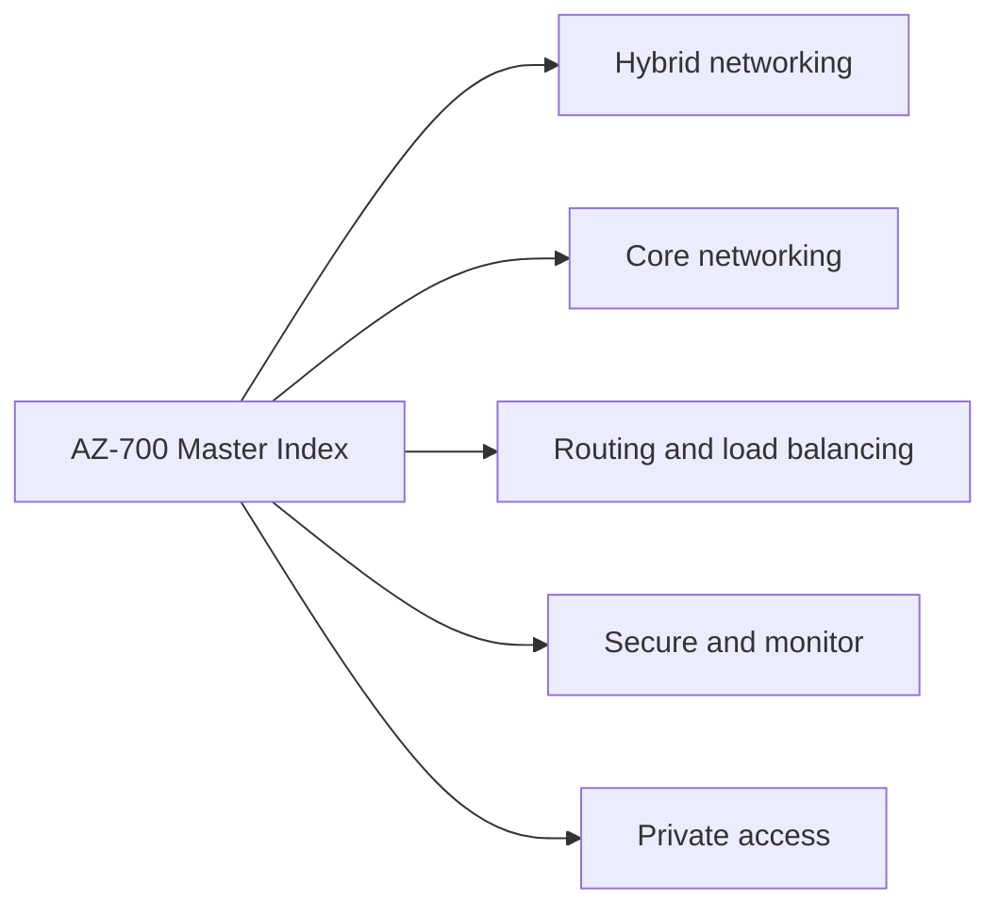
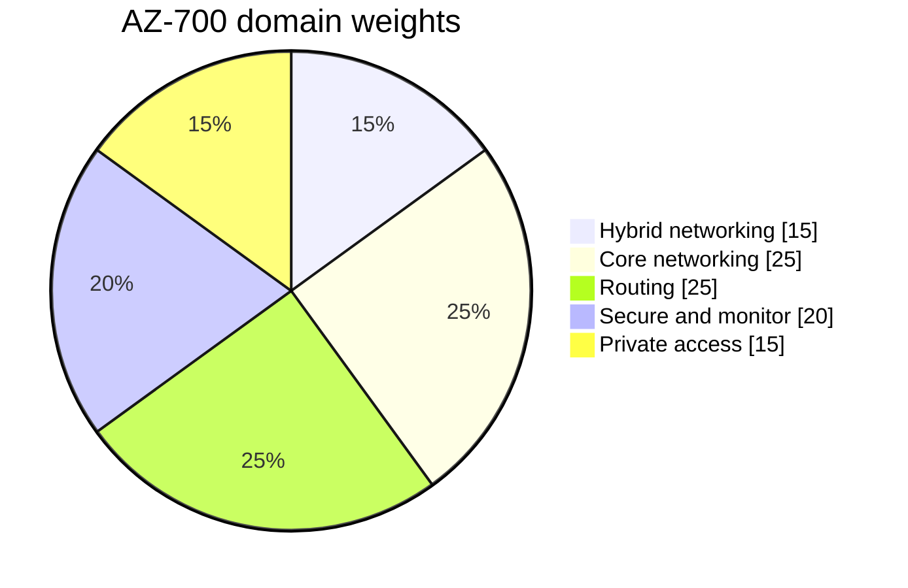

# AZ-700 - Designing and Implementing Microsoft Azure Networking Solutions - Visual Study Guide

> Concept-only study aid. No exam questions reproduced. Source PDF (if any) stays local + gitignored.

**Skills outline:** https://learn.microsoft.com/credentials/certifications/resources/study-guides/az-700

## Master mind map

## Domain map

## Domain weights

## Recommended study order

```mermaid
gantt
    title Suggested study plan
    dateFormat X
    axisFormat Day %d
    section Plan
    Core networking         :t1, 0, 3d
    Routing                 :t2, after t1, 3d
    Hybrid networking       :t3, after t2, 2d
    Secure and monitor      :t4, after t3, 2d
    Private access          :t5, after t4, 2d
    Cheatsheet and review   :t6, after t5, 1d
```

---

**Next:** open [01-hybrid-networking.md](01-hybrid-networking.md)
