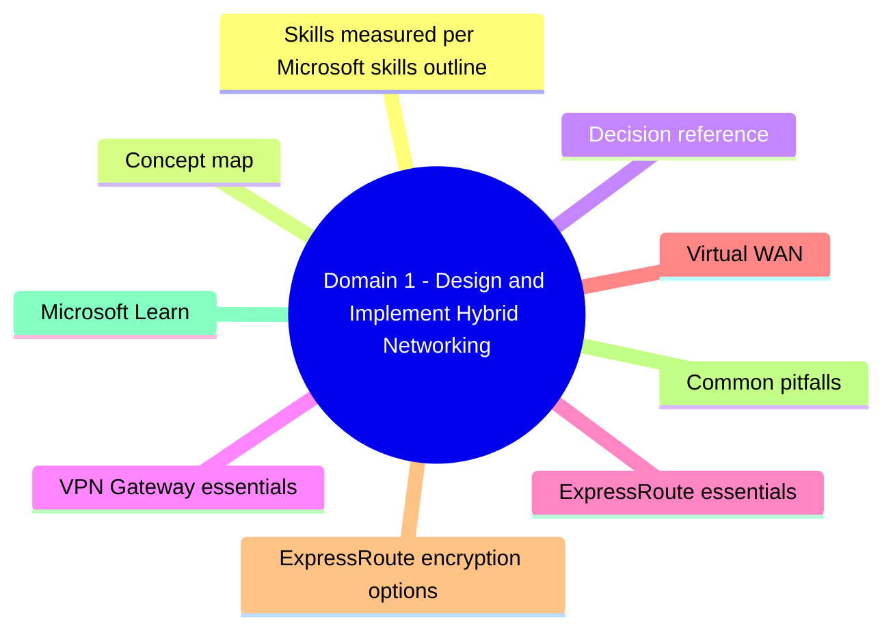
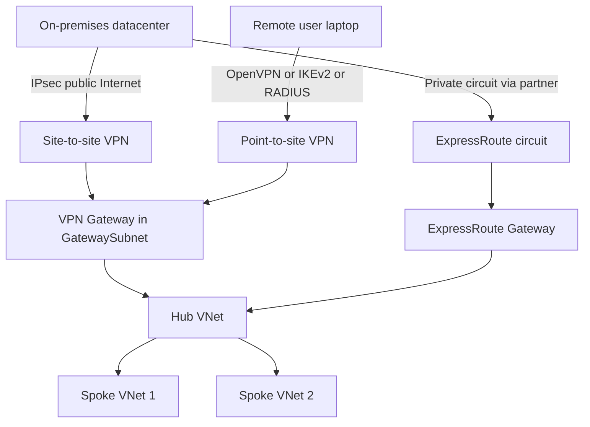

# Domain 1: Design and Implement Hybrid Networking

> Connecting on-premises and other clouds to Azure: VPN Gateway, ExpressRoute, Virtual WAN.

## Domain mind map

## Skills measured (per Microsoft skills outline)

- Design and implement Azure VPN Gateway (site-to-site, point-to-site).
- Design and implement Azure ExpressRoute (circuits, peerings, FastPath, Global Reach).
- Design and implement Azure Virtual WAN.
- Design and implement encryption over ExpressRoute.

## Concept map

## Decision reference

| Need | Choice | Why |
|---|---|---|
| Cheap encrypted tunnel from one branch | Site-to-site VPN | IPsec/IKEv2 over Internet |
| Many branches, central management | Virtual WAN | Hub-and-spoke at scale |
| Private, predictable, high bandwidth | ExpressRoute | No Internet, SLA-backed |
| Roaming users from laptops | Point-to-site VPN | OpenVPN, IKEv2, certificate or RADIUS or Entra |
| Maximum redundancy on a single circuit | Active-active VPN gateway | Two tunnels, BGP |
| Connect two ER circuits in different geos | ExpressRoute Global Reach | Backbone-to-backbone |
| Bypass gateway for ER traffic to dest VM | FastPath | Data plane goes direct |
| Encrypt over ExpressRoute | IPsec over private peering, or MACsec on ER Direct | Zero-trust on private link |

## VPN Gateway essentials

- **GatewaySubnet** required, /27 or larger. Cannot host other resources.
- **SKUs**: VpnGw1..VpnGw5 (and AZ variants for zone redundancy). Basic is legacy, no SLA.
- **Routing**: route-based (BGP) recommended; policy-based for legacy hardware only.
- **Active-active**: 2 instances, 2 public IPs, 2 tunnels per on-prem device. BGP required for proper failover.
- **Point-to-site protocols**: OpenVPN, IKEv2, SSTP. Auth: certificate, RADIUS, or Microsoft Entra (OpenVPN only).
- **VNet-to-VNet** via VPN gateways is supported, but VNet peering is faster + cheaper for same-region.

## ExpressRoute essentials

- **Connectivity providers** terminate the customer link at a Microsoft Enterprise Edge (MSEE) router.
- **Peerings**:
  - **Private peering**: VNets, your IaaS workloads.
  - **Microsoft peering**: Microsoft 365, public PaaS endpoints over private path.
- **SKUs**: Standard (regional) vs Premium (global access + more route prefixes + connect more VNets).
- **FastPath**: ER data plane bypasses the ER Gateway. Useful for high-throughput VM destinations.
- **Global Reach**: links two ER circuits in different geographies via Microsoft backbone.
- **ExpressRoute Direct**: 10/100 Gbps direct port pair, supports MACsec encryption.
- **SLA**: 99.95% on the Microsoft side; combine with redundant circuits in different peering locations.

## Virtual WAN

- **Hub-and-spoke at scale**, fully managed by Microsoft.
- **Standard vs Basic**: Standard supports ER, P2S, custom routing, secured hubs, NVA in hub.
- **Secured Virtual Hub**: integrates Azure Firewall or 3rd-party SaaS firewall.
- **Hub-to-hub** transit included.
- **Routing intent / routing policies**: declare "all internet traffic via firewall" or "all private traffic via firewall" without writing UDRs.
- **Branch connectivity**: VPN sites, ExpressRoute, P2S all terminate at the same hub.

## ExpressRoute encryption options

| Option | Where encryption happens |
|---|---|
| IPsec over ER private peering (VPN Gateway over ER) | Inside VNet, terminated by VPN Gateway |
| MACsec on ER Direct | Layer 2 between customer and Microsoft port |
| Host-based (e.g. SMB encryption, app TLS) | Inside the workload |

## Common pitfalls

- Forgetting GatewaySubnet sizing - it must allow gateway scale-out.
- Using Basic SKU for production - no SLA, no zone redundancy, no active-active.
- Mixing route-based and policy-based gateways across the same connection.
- Assuming peered VNets share the on-prem VPN gateway automatically - **enable "Use remote gateways"** on the spoke and **"Allow gateway transit"** on the hub.
- Forgetting that Global Reach is billed per circuit, both ends.

## Microsoft Learn

- [VPN Gateway docs](https://learn.microsoft.com/azure/vpn-gateway/)
- [ExpressRoute docs](https://learn.microsoft.com/azure/expressroute/)
- [Virtual WAN docs](https://learn.microsoft.com/azure/virtual-wan/)

---

**Next:** [02-core-networking.md](02-core-networking.md)
