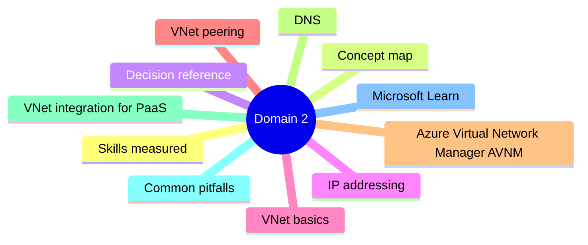
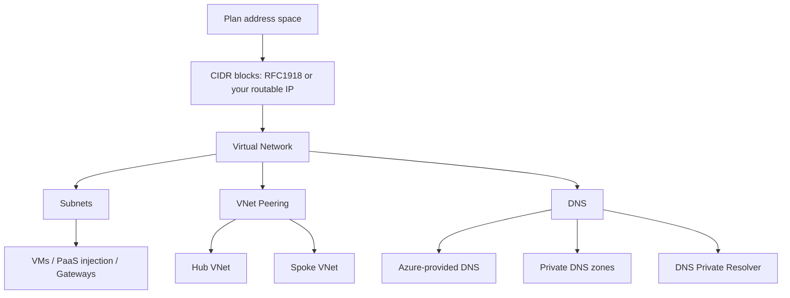

# Domain 2: Design and Implement Core Networking Infrastructure

> Virtual networks, subnets, IP addressing, VNet peering, name resolution, and VNet integration for Azure services.

## Domain mind map

## Skills measured

- Design and implement IP addressing (public + private).
- Design and implement Azure Virtual Networks and subnets.
- Design and implement VNet peering and Virtual Network Manager.
- Design and implement Azure DNS (public, private, DNS resolver).
- Design and implement VNet integration for Azure services.

## Concept map

## Decision reference

| Need | Choice |
|---|---|
| Many VNets, simplify rules at scale | Azure Virtual Network Manager (AVNM) |
| Connect 2 VNets same region, low latency | VNet peering (or AVNM connectivity config) |
| Hub-spoke topology, central FW + gateway | Peering with "use remote gateway" on spokes |
| Two VNets in different regions | Global VNet peering |
| On-prem name resolution into Azure | DNS Private Resolver inbound endpoint |
| Azure name resolution out to on-prem | DNS Private Resolver outbound endpoint + forwarding rules |
| Resolve PaaS private endpoints by name | Private DNS zone linked to VNet |
| Static public IP for VPN/AppGw/LB | Standard SKU public IP, zone-redundant or zonal |
| Reserve IPs across subscriptions | Public IP prefix |

## IP addressing

- **Private address space**: RFC 1918 (10.0.0.0/8, 172.16.0.0/12, 192.168.0.0/16) - or any CIDR you control. Avoid overlap with on-prem.
- **Reserved per subnet**: first 4 + last 1 (network, default GW, 2x DNS, broadcast). A /29 has only 3 usable IPs.
- **Public IP SKUs**: Basic (legacy, retired Sep 2025), **Standard** (zone-redundant, secure-by-default, required for Standard LB / AppGw v2 / VPN Gateway).
- **Public IP allocation**: Static (recommended for DNS A records) or Dynamic.
- **Public IP Prefix**: contiguous block of public IPs, useful for predictable egress.

## VNet basics

- **Azure-reserved subnets**:
  - `GatewaySubnet` - VPN/ER gateway. /27 or larger.
  - `AzureFirewallSubnet` - /26 (with mgmt subnet `AzureFirewallManagementSubnet` /26 for Basic SKU).
  - `AzureBastionSubnet` - /26 minimum.
  - `RouteServerSubnet` - /27 minimum.
  - `AzureCloudSubnet` - reserved for Azure services in the future.
- **Subnet delegation**: gives a service permission to inject NICs (e.g. `Microsoft.Web/serverFarms` for App Service VNet integration).
- **Service association links**: track which service occupies a subnet.

## VNet peering

- Non-transitive: A peers B and B peers C does **not** mean A reaches C. Use NVA / firewall in hub or Virtual Network Manager mesh.
- **Gateway transit**: hub VNet's VPN/ER gateway used by spokes (`AllowGatewayTransit` on hub, `UseRemoteGateways` on spokes).
- **Global VNet peering**: cross-region. Some services (e.g. Basic Internal LB) historically did not work across global peering - check current docs.

## Azure Virtual Network Manager (AVNM)

- Define connectivity configurations (mesh, hub-spoke, hub-spoke with mesh on spokes) declaratively.
- Network groups - dynamic membership via Azure Policy (e.g. all VNets with tag `env=prod`).
- Security admin rules - higher precedence than NSG, applied to network groups.

## DNS

- **Azure-provided DNS** (168.63.129.16) - resolves Azure resource hostnames + Internet via recursive resolution.
- **Custom DNS** - point VNet at custom servers (e.g. on-prem AD DNS).
- **Public DNS zones** - host external domain (`contoso.com`).
- **Private DNS zones** - internal name resolution. Linked to VNets.
  - **Auto-registration**: VMs in linked VNet auto-register A records.
- **DNS Private Resolver** - PaaS recursive resolver inside VNet:
  - **Inbound endpoint**: on-prem queries Azure private zones.
  - **Outbound endpoint** + **forwarding ruleset**: Azure VMs query specific zones via on-prem DNS.

## VNet integration for PaaS

| Service | Integration model |
|---|---|
| App Service | Regional VNet integration (delegated subnet) - outbound only; inbound via Private Endpoint |
| Functions | Same as App Service |
| Azure SQL DB | Service endpoint or Private Endpoint |
| Storage | Service endpoint, Private Endpoint, or VNet-injected (FileShares with Premium) |
| AKS | Azure CNI / kubenet / Azure CNI Overlay; nodes live in your subnet |
| Cosmos DB | Service endpoint or Private Endpoint |

## Common pitfalls

- Overlapping address space with on-prem - cannot be peered or VPN-routed.
- Forgetting that NSG flow logs require a storage account in the **same region**.
- Linking too few VNets to a Private DNS zone (limit ~1000 by default; raise via support).
- Using same address space across spokes - peering succeeds but routing breaks.
- AzureBastionSubnet sized /27 - too small for newer SKUs; use /26.

## Microsoft Learn

- [Virtual Network overview](https://learn.microsoft.com/azure/virtual-network/virtual-networks-overview)
- [Azure DNS Private Resolver](https://learn.microsoft.com/azure/dns/dns-private-resolver-overview)
- [Azure Virtual Network Manager](https://learn.microsoft.com/azure/virtual-network-manager/overview)

---

**Next:** [03-routing.md](03-routing.md)
