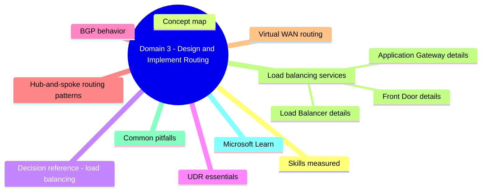
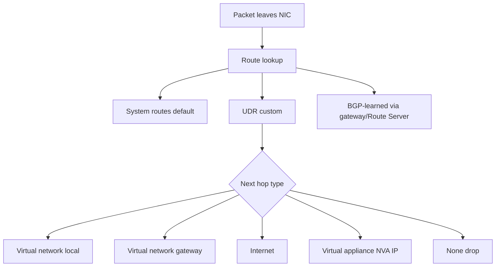
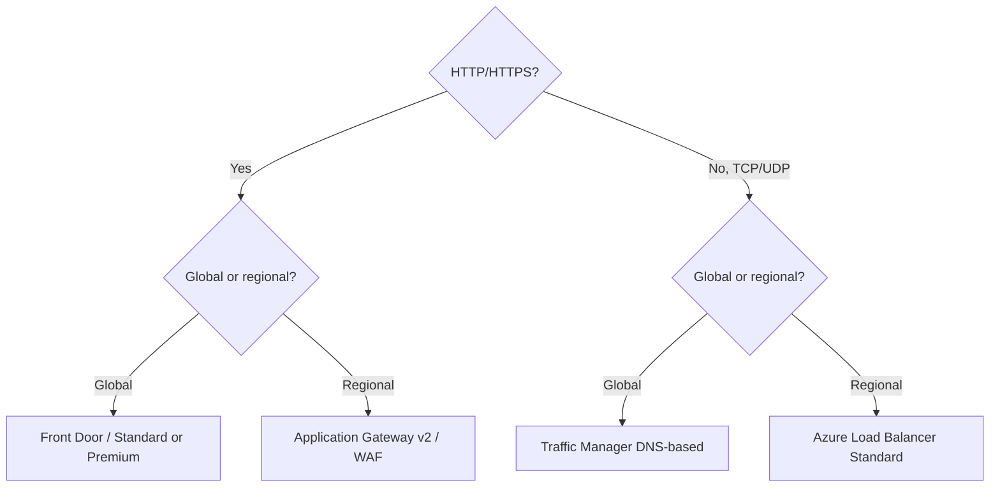

# Domain 3: Design and Implement Routing

> System routes, UDR, BGP, Route Server, hub-spoke patterns, and load balancing services.

## Domain mind map

## Skills measured

- Design and implement user-defined routes (UDR) and BGP.
- Design and implement Azure Route Server.
- Design and implement load balancing (Azure Load Balancer, Application Gateway, Front Door, Traffic Manager).
- Design and implement Virtual WAN routing.

## Concept map

## Decision reference: load balancing

## UDR essentials

- **Route table** is attached to a subnet. Rules: longest prefix match, then UDR > BGP > system.
- **Next hop types**: VirtualNetwork, VirtualNetworkGateway, Internet, VirtualAppliance (with private IP), None.
- **Force tunneling**: 0.0.0.0/0 -> VirtualNetworkGateway sends Internet egress through on-prem.
- **BGP propagation**: enable on subnets that should learn on-prem routes from VPN/ER gateway. Disable for subnets behind firewall.
- **Service tag routes** (e.g. `Storage`, `AzureCloud`) avoid hardcoding IPs.

## BGP behavior

- VPN Gateway / ER Gateway / Route Server / NVAs in your VNet exchange routes via BGP.
- **Azure Route Server**: peer your NVA's BGP with Azure backbone so VNet route table is updated automatically.
  - Eliminates manual UDRs for NVA-driven routing.
  - Enables transit between ER and VPN gateways via the NVA.
- **AS Path prepending** influences inbound preference for active-active or dual-circuit.

## Hub-and-spoke routing patterns

| Pattern | UDR strategy |
|---|---|
| Spoke -> hub firewall -> Internet | UDR on spoke: 0.0.0.0/0 -> Firewall private IP |
| Spoke -> hub firewall -> spoke (transit) | UDR on each spoke for other spokes' CIDR -> Firewall private IP |
| Spoke -> on-prem via hub gateway | "Use remote gateways" on spoke + BGP propagation enabled |
| Bypass firewall for specific PaaS | UDR with service tag -> Internet (or VirtualNetworkGateway) |

## Virtual WAN routing

- **Hub route tables**: Default + None + custom. Each connection associates to one route table and propagates to one or more.
- **Routing intent / routing policies**: high-level intent ("inspect all internet traffic", "inspect all private traffic") rather than manual route engineering. Requires Secured Virtual Hub.
- **Hub-to-hub**: routes auto-propagate between hubs via Microsoft backbone.

## Load balancing services

| Service | Layer | Scope | Notes |
|---|---|---|---|
| **Azure Load Balancer** | L4 | Regional | Public or internal. Standard SKU is zone-redundant + secure by default. |
| **Application Gateway** | L7 | Regional | TLS termination, path-based routing, **WAF** (v2). Autoscaling. |
| **Azure Front Door** | L7 | Global | Anycast, edge POPs, WAF Premium, caching. Standard/Premium SKUs. |
| **Traffic Manager** | DNS | Global | Routing methods: priority, weighted, performance, geographic, multivalue, subnet. |
| **Azure CDN / Front Door CDN** | L7 cache | Global | Static content acceleration. |

### Load Balancer details

- **Backend pool**: VMs by NIC, VMSS, IP. Now supports cross-region LB (Global tier).
- **Health probes**: TCP, HTTP, HTTPS.
- **Outbound rules**: explicit SNAT for VMs without instance-level public IP. Prefer **NAT Gateway** for outbound.
- **HA Ports rule**: load-balance all ports + protocols (great for NVAs).

### Application Gateway details

- **v2 only** for new work: autoscale, zone-redundant, WAF v2.
- **Listener types**: basic, multi-site (host-based), private (internal v2).
- **Rewrite rules**: HTTP headers + URL.
- **mTLS** (frontend) supported on v2.

### Front Door details

- **Standard**: routing + caching. **Premium**: + WAF, Private Link to origin, bot manager, additional rules.
- **Origin groups** support priority + weighted load balancing.
- **Rules engine** for header/URL manipulation, redirects, cache controls.

## Common pitfalls

- Forgetting that the **most specific UDR wins**, not the order of rules.
- BGP propagation enabled on AzureFirewallSubnet causes asymmetric routing - keep it off (default is fine).
- Using v1 Application Gateway for new deployments - choose v2 always.
- Front Door + Application Gateway double-WAF without disabling AppGw WAF causes duplicate rule hits.
- Confusing global VNet peering with Global Reach - they are different products.

## Microsoft Learn

- [Virtual network traffic routing](https://learn.microsoft.com/azure/virtual-network/virtual-networks-udr-overview)
- [Azure Route Server](https://learn.microsoft.com/azure/route-server/)
- [Load balancing decision tree](https://learn.microsoft.com/azure/architecture/guide/technology-choices/load-balancing-overview)

---

**Next:** [04-secure-monitor.md](04-secure-monitor.md)
