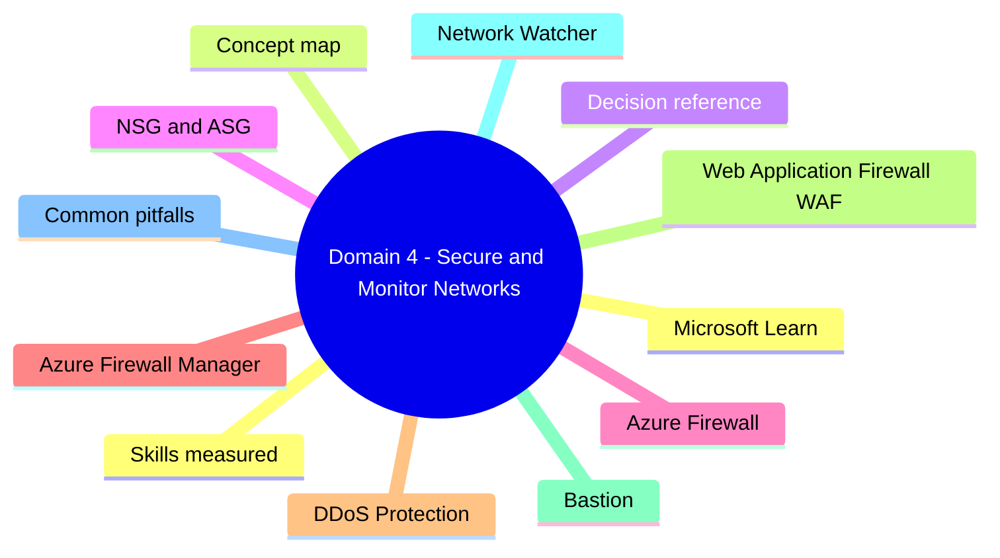
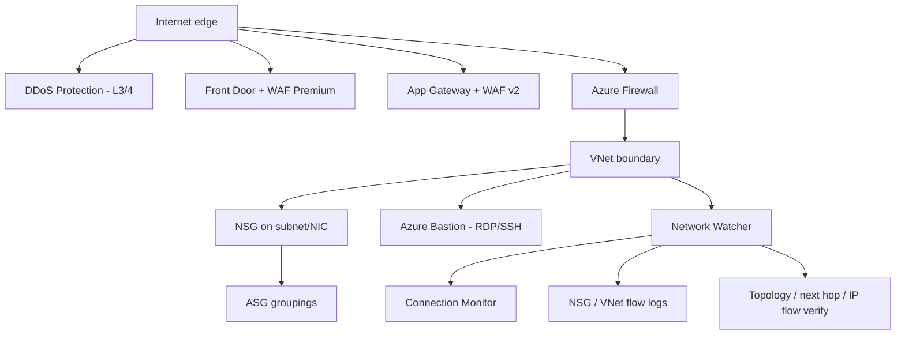

# Domain 4: Secure and Monitor Networks

> NSG, ASG, Azure Firewall, DDoS Protection, WAF, Bastion, Network Watcher.

## Domain mind map

## Skills measured

- Design and implement Azure Firewall and Firewall Manager.
- Design and implement network security groups (NSG) and application security groups (ASG).
- Design and implement Azure DDoS Protection.
- Design and implement Web Application Firewall (WAF).
- Design and implement network monitoring (Network Watcher, Connection Monitor, NSG/VNet flow logs).

## Concept map

## Decision reference

| Need | Choice |
|---|---|
| Allow/deny TCP-UDP at subnet/NIC | NSG (5-tuple + service tags + ASGs) |
| Logical grouping for NSG rules | ASG |
| Stateful, central FW with FQDN + IDPS + TLS inspection | Azure Firewall (Premium for IDPS + TLS) |
| Manage many firewalls/policies | Azure Firewall Manager |
| Mitigate volumetric attacks | DDoS Protection (Network or IP plan) |
| Layer 7 attacks (SQLi, XSS) on web app | WAF on App Gateway or Front Door |
| Secure RDP/SSH without public IP on VM | Azure Bastion |
| Verify connectivity between two endpoints | Connection Monitor |
| Capture packets on demand | Network Watcher packet capture |
| Long-term flow telemetry | NSG flow logs (legacy) or VNet flow logs (preferred) |

## NSG and ASG

- **Stateful**, evaluated at subnet first, then NIC. Both must allow.
- **Default rules**: AllowVNetInbound, AllowAzureLoadBalancerInbound, DenyAllInbound; outbound to AzureLoadBalancer + Internet allowed.
- **Service tags**: `VirtualNetwork`, `AzureLoadBalancer`, `Internet`, `Storage.<region>`, `Sql.<region>`, etc.
- **ASG**: attach to NICs; reference in NSG source/destination instead of IP ranges.
- Effective security rules: combine subnet + NIC NSGs.

## Azure Firewall

- **SKUs**: Basic (small SMB), Standard (most workloads), **Premium** (TLS inspection, IDPS, URL filtering, web categories).
- **Firewall Policy**: rules grouped by policy, hierarchical (parent/child), rule collections (NAT, Network, Application).
- **Forced tunneling**: send firewall management traffic via on-prem - requires `AzureFirewallManagementSubnet`.
- **Threat intelligence**: alert or alert+deny on Microsoft TI feeds.
- **DNS proxy**: Firewall acts as DNS proxy so FQDN rules work consistently.
- **IDPS** (Premium): signature-based detection + optional prevention.
- **TLS inspection** (Premium): decrypt outbound HTTPS using customer CA cert in Key Vault + managed identity.

## Azure Firewall Manager

- Central management for many Firewalls/policies, including Secured Virtual Hubs in Virtual WAN.
- Hub virtual networks (own VNet) vs Secured Virtual Hubs (Virtual WAN).

## DDoS Protection

| Tier | Scope |
|---|---|
| Network Protection | All public IPs in protected VNets, per-subscription |
| **IP Protection** | Per public IP - cheaper for small estates |

- Always-on traffic monitoring + adaptive tuning.
- Rapid Response (DRR) on premium plans for active attacks.
- Cost protection: scaling-out costs during attack are credited.

## Web Application Firewall (WAF)

- Available on **Application Gateway v2** (regional) and **Front Door Premium** (global).
- **Managed rule sets**: OWASP CRS 3.x, Microsoft Bot Manager.
- **Custom rules**: rate limiting, geo block, header match.
- Modes: **Detection** (log only) or **Prevention** (block).

## Bastion

- **AzureBastionSubnet** /26 minimum.
- SKUs: Developer (free, single VM), Basic, Standard, Premium (host scaling, native client, IP-based connection, shareable links, session recording on Premium).
- TLS over 443 from browser; no public IP on the VM required.

## Network Watcher

- **Per-region** automatically enabled.
- **Connection Monitor**: synthetic probes between agents (VMs / on-prem) - replaces older Connection Monitor (Classic).
- **NSG flow logs v2** (legacy after Nov 2025) -> **VNet flow logs** are the recommended path: capture flows at VNet/subnet/NIC, integrate with Traffic Analytics.
- **IP flow verify**: simulate a 5-tuple to determine NSG allow/deny.
- **Next hop**: shows what next hop a packet from a NIC takes (system route, UDR, BGP, etc.).
- **Effective routes / Effective security rules**: per-NIC.
- **Packet capture**: on-demand or via alert action.
- **NSG diagnostic**: legacy view; prefer Effective security rules + flow logs.

## Common pitfalls

- Putting NSG on `GatewaySubnet` - blocks gateway management traffic. Don't.
- Forgetting that Azure Firewall requires Standard SKU public IPs.
- Confusing WAF (L7 app attacks) with DDoS Protection (volumetric L3/4).
- Bastion SKU mismatch - some features (native client, IP-based) need Standard or Premium.
- NSG flow logs in retired status - migrate to VNet flow logs before Nov 2025 deprecation cliff.

## Microsoft Learn

- [Azure Firewall](https://learn.microsoft.com/azure/firewall/)
- [DDoS Protection](https://learn.microsoft.com/azure/ddos-protection/)
- [Network Watcher](https://learn.microsoft.com/azure/network-watcher/)
- [VNet flow logs](https://learn.microsoft.com/azure/network-watcher/vnet-flow-logs-overview)

---

**Next:** [05-private-access.md](05-private-access.md)
