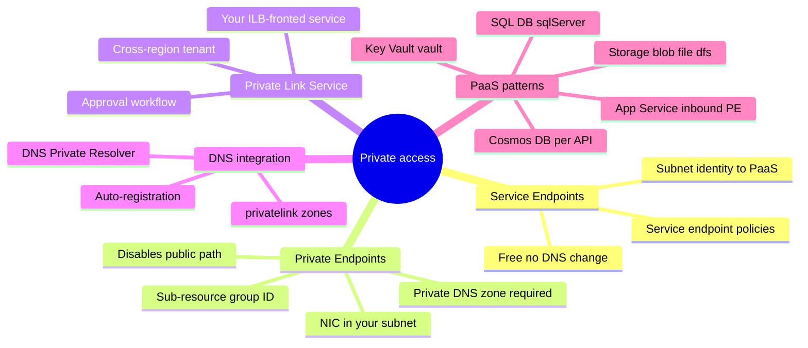
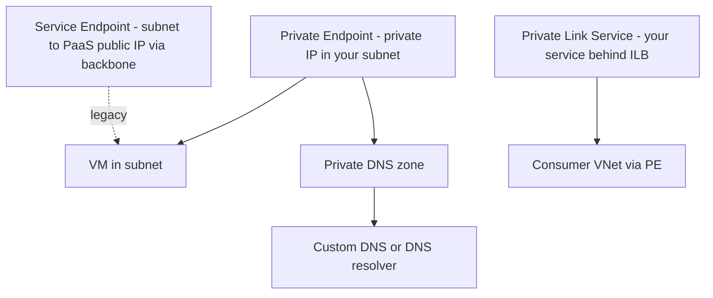
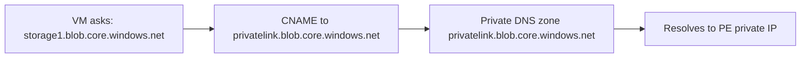

# Domain 5: Design and Implement Private Access to Azure Services

> Service Endpoints, Private Endpoints, Private Link, and PaaS VNet integration.

## Skills measured

- Design and implement service endpoints (and service endpoint policies).
- Design and implement Private Endpoints and Private Link.
- Design and implement Private Link Service to expose your own service.
- Design DNS integration for Private Endpoints.

## Domain mind map

## Concept map

## Decision reference

| Scenario | Choose | Why |
|---|---|---|
| Lock storage account to a single subnet | Service endpoint + storage firewall | Cheap, no DNS changes |
| Expose Azure SQL on a private IP inside VNet | Private Endpoint | Removes public exposure |
| Provide your own SaaS to many customers privately | Private Link Service | Customers PE into your ILB |
| App Service callable only from VNet | Private Endpoint on App Service + access restrictions |
| Storage egress restricted to specific subscriptions | Service endpoint policy |

## Service Endpoints (legacy preferred for some specific scenarios)

- Adds the subnet's identity to PaaS firewall: traffic still goes to the PaaS public IP, but over the Microsoft backbone.
- **Service endpoint policies**: restrict which storage accounts the subnet can reach.
- Free, simple, fast - but does **not** give a private IP and does not work cross-region for all services.

## Private Endpoints

- A NIC injected into your subnet with a **private IP**, which proxies to a PaaS resource (or Private Link Service).
- The PaaS resource's public endpoint can be disabled to prevent any internet access.
- **Group ID / sub-resource**: e.g. `blob`, `file`, `dfs` for storage; `sqlServer` for SQL DB.
- Limits: cannot use NSG against a Private Endpoint NIC unless the feature is enabled at subnet level (`PrivateEndpointNetworkPolicies`).

### Private Endpoint DNS

- **Required pattern**: link a Private DNS zone (`privatelink.<service>.<suffix>`) to every VNet that resolves the PE.
- **Auto-registration via Private Endpoint**: enable when creating the PE so it registers an A record automatically.
- For on-prem callers: use **DNS Private Resolver inbound endpoint** so on-prem DNS forwards to Azure private zones.

## Private Link Service

- **You** put a Standard Internal Load Balancer in front of your service, then publish a Private Link Service over it.
- Consumers create a Private Endpoint that targets your alias.
- Approval workflow gates new consumer connections.
- Works across regions and tenants.

## VNet integration patterns

| PaaS service | Private path |
|---|---|
| Storage | Private Endpoint per sub-resource (blob, file, dfs, queue, table) |
| Azure SQL DB | Private Endpoint, sub-resource `sqlServer` |
| Cosmos DB | Private Endpoint per API (sql, mongo, etc.) |
| Key Vault | Private Endpoint, sub-resource `vault` |
| App Service | Inbound: Private Endpoint; Outbound: regional VNet integration (delegated subnet) |
| AKS | Private cluster: API server has private IP (uses Private Link under the hood) |
| Azure OpenAI / AI Foundry | Private Endpoint + restrict public network access |

## Common pitfalls

- Private Endpoint created but DNS not linked - clients still resolve public IP and go via Internet.
- Multiple PEs across regions sharing one Private DNS zone - works, but auto-registration race conditions if not configured carefully.
- Forgetting to disable public network access on the PaaS resource - PE alone doesn't block public path.
- Using service endpoint with storage firewall, then PE on the same VNet - both technologies coexist but client routing can be surprising.
- Application Gateway / Front Door Premium origin via Private Link not approved on origin - traffic stalls in pending state.

## Microsoft Learn

- [Private Link overview](https://learn.microsoft.com/azure/private-link/private-link-overview)
- [Private Endpoint DNS integration](https://learn.microsoft.com/azure/private-link/private-endpoint-dns)
- [Service endpoints](https://learn.microsoft.com/azure/virtual-network/virtual-network-service-endpoints-overview)

---

**Next:** [05-exam-cheatsheet.md](05-exam-cheatsheet.md)
