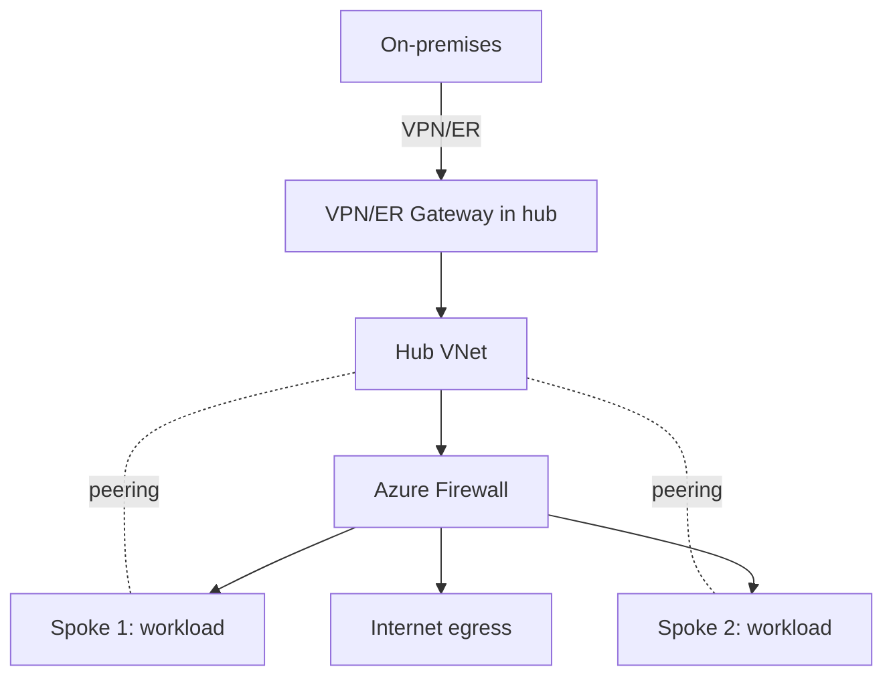
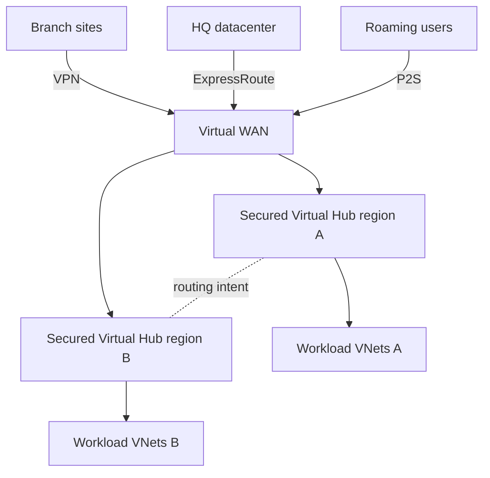
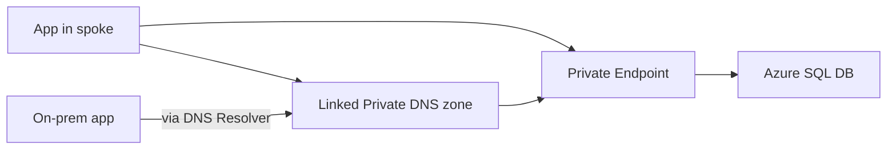
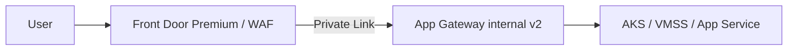
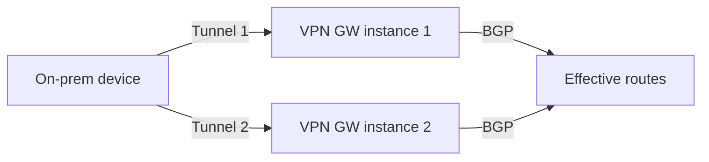

# AZ-700 Reference Architectures

> Canonical Azure networking patterns. Memorize the shapes.

## 1. Hub-and-spoke with Azure Firewall

- Spokes UDR 0/0 -> firewall private IP.
- Hub gateway transit + spokes "use remote gateway".
- Inbound web traffic via App Gateway in front of AFW (DNAT) or via Front Door.

## 2. Virtual WAN with Secured Virtual Hub

- Routing intent: "all internet via firewall" + "all private via firewall".
- Hub-to-hub transit handled by Microsoft.

## 3. Private Endpoint hub for PaaS

- Centralize PEs in a hub VNet, link Private DNS zones to all spokes.
- DNS Private Resolver inbound endpoint serves on-prem DNS forwarders.

## 4. Global L7 with Front Door Premium + private origin

- Front Door Premium reaches internal App Gateway v2 via Private Link.
- WAF at edge; AppGw WAF disabled to avoid double rule hits.

## 5. Active-active VPN gateway with BGP

- Two public IPs, two tunnels, two instances. BGP advertises routes from both.

---

[Master Index](00-MASTER-INDEX.md)
